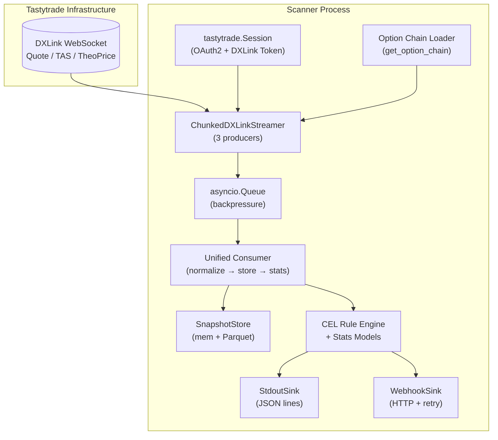
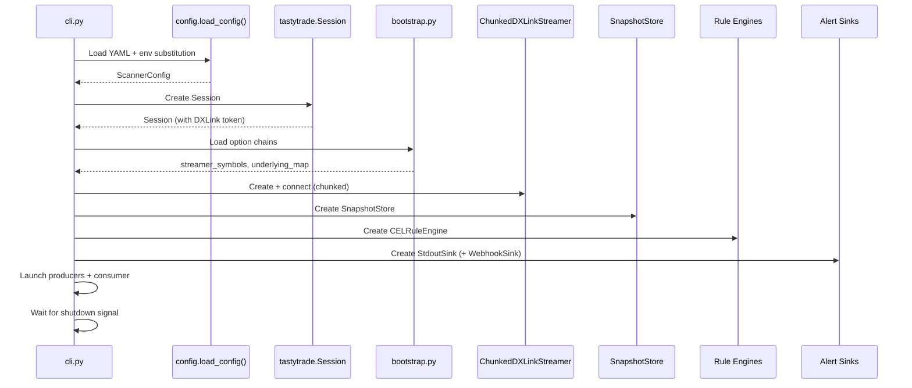

# System Architecture

This document describes the technical process flows, component interactions, and data flow through the DXLink Scanner.

## High-Level Data Flow



## Component Architecture

### 1. Authentication Layer (`src/dxlink_scanner/auth.py`)

**Purpose**: Obtain and maintain valid Tastytrade session + DXLink token.

```python
from tastytrade.session import Session

session = Session(
    provider_secret=client_secret,
    refresh_token=refresh_token,
    is_test=sandbox,
)
```

**Flow**:
1. Load credentials from config (env var substitution)
2. Create `Session` → auto-fetches DXLink token
3. Pass session to `ChunkedDXLinkStreamer` and chain loader
4. Session auto-refreshes on expiry

### 2. Option Chain Loading (`src/dxlink_scanner/bootstrap.py`)

**Purpose**: Fetch 0DTE option chain for each configured underlying, extract all streamer symbols.

```python
from tastytrade.instruments import get_option_chain, get_future_option_chain

chains = get_option_chain(session, "SPY")  # dict[date, list[Option]]
chains = get_future_option_chain(session, "ES")  # dict[date, list[FutureOption]]
```

**Outputs**:
- `symbol → streamer_symbol` mapping for DXLink subscription
- `symbol → underlying_symbol` mapping for consolidation
- Strike/expiry metadata for dynamic strike management

### 3. DXLink Streaming (`src/dxlink_scanner/chunked_streamer.py`)

**Purpose**: Subscribe to real-time market data via WebSocket with automatic payload chunking.

**Three Producers** (run concurrently):
```python
# In cli.py:_run_scanner()
async def _produce_quotes():
    async for quote in streamer.listen(Quote):
        await queue.put(normalize_quote(quote))

async def _produce_time_and_sales():
    async for tas in streamer.listen(TimeAndSale):
        await queue.put(normalize_timeandsale(tas))

async def _produce_theoprices():
    async for tp in streamer.listen(TheoPrice):
        await queue.put(normalize_theoprice(tp))
```

**Subscription Strategy**:
| Event Type | Symbols | Notes |
|------------|---------|-------|
| Quote | Underlying symbols only | Best bid/ask; mid_price = (bid+ask)/2 |
| TimeAndSale | All option symbols + underlying | Trade prints |
| TheoPrice | All option symbols | Delta, gamma, dividend, interest, theo_price |

**Chunking**: The `ChunkedDXLinkStreamer` wrapper splits large symbol lists into multiple `FEED_SUED_SUBSCRIPTION` messages, each staying under 60k bytes (DXLink limit is 64k).

### 4. Backpressure Queue (`asyncio.Queue`)

**Purpose**: Buffer between producers and consumer with explicit backpressure.

```python
queue = asyncio.Queue(maxsize=config.stream.backpressure_queue_size)  # default 500
```

**Drop Policy**: FIFO (oldest dropped) — older events have less analytical value.

### 5. Unified Consumer (`src/dxlink_scanner/cli.py:_consume_consolidated`)

**Purpose**: Single consumer loop normalizing all event types → `ConsolidatedEvent` → `SnapshotStore` → statistical models → rule engine.

```python
async def _consume_consolidated(queue, store, rules, sinks, ...):
    while True:
        event = await queue.get()
        store.ingest(event)

        if event.source_type == "TIME_AND_SALE":
            snap = store.get(event.symbol)
            # Compute local delta from Quote mid_price
            local_delta = _compute_local_delta(event.symbol, mid_price)
            # Compare with DXLink delta for drift monitoring
            drift = float(local_delta) - float(dxlink_delta)
            DRIFT_LOGGER.info(f"delta_drift symbol=... dxlink=... local=... diff=...")

            # Update statistical models
            bayesian_models[underlying].update(1)
            hawkes_models[underlying].add_event(trade_time)
            seasonality_models[underlying].add_observation(...)
            vap.add_trade(price, size)
            flow.update(snap, price, size)
            cross_asset_hawkes.add_event(underlying, trade_time)

            # Enrich TAS event and evaluate rules
            tas_event = TimeAndSaleEvent(..., delta=delta)
            alert = rules.process(tas_event)
            if alert:
                for sink in sinks:
                    await sink.send(alert)
        queue.task_done()
```

**Normalization** (`src/dxlink_scanner/models.py`):
| DXLink Type | Normalizer | Key Fields Extracted |
|-------------|------------|---------------------|
| Quote | `normalize_quote()` | bid/ask price |
| TimeAndSale | `normalize_timeandsale()` | last_trade_price, last_trade_size, last_trade_type |
| TheoPrice | `normalize_theoprice()` | theo_price, underlying_price, delta, gamma, dividend, interest |

### 6. Snapshot Store (`src/dxlink_scanner/snapshot_store.py`)

**Purpose**: In-memory per-symbol state + periodic Parquet persistence.

```python
class SnapshotStore:
    def __init__(self, config, underlying_map):
        self._snapshots: dict[str, ConsolidatedSnapshot] = {}
        self._buffer: list[ConsolidatedEvent] = []

    def ingest(self, event: ConsolidatedEvent):
        snap = self._snapshots.get(event.symbol)
        merge_into_snapshot(snap, event)
        self._buffer.append(event)
```

**Parquet Output**:
- Partitioned by date: `data/events/YYYY-MM-DD/events_v2_<uuid>.parquet`
- Schema: `schemas/v2.py` (PyArrow)
- Flush triggers: `flush_batch_size` (10K) OR `flush_interval_sec` (300s)

### 7. Rule Engine (CEL)

The `CELRuleEngine` evaluates config-driven rules using the Common Expression Language. See [docs/cel_rules.md](cel_rules.md) for the full reference.

**Activation Context** (variables available in CEL expressions):
```python
activation = {
    "trade": {symbol, price, size, timestamp, delta, delta_weighted_size,
              bid_price, ask_price, trade_type},
    "option": {type, strike},  # if option
    "underlying": {symbol, price},  # if underlying
    "stats": {median, mad, count, mean, std, p25, p75, p90, p95, p99,
              z_score, modified_z_score, rth_*, eth_*},
    "config": {abs_min_size, size_mult, p95_size, p95_delta_weighted_size,
               bayesian_mean, hawkes_intensity, vpin, regime, ...},
}
```

### 8. Statistical Models (`src/dxlink_scanner/stats/`)

| Model | Module | Purpose |
|-------|--------|---------|
| Bayesian Gamma-Poisson | `statistical_analysis.py` | Trade count posterior, anomaly scoring |
| Hawkes Process | `statistical_analysis.py` | Self-exciting trade clustering |
| Time-of-Day Seasonality | `statistical_analysis.py` | Intraday volume pattern normalization |
| Cross-Symbol Pooling | `statistical_analysis.py` | Hierarchical Bayes for sparse symbols |
| Volume-at-Price | `statistical_analysis.py` | POC, value area, imbalance |
| Regime Detector | `statistical_analysis.py` | Volatility regime classification |
| VPIN Calculator | `microstructure.py` | Order flow toxicity |
| Flow Metrics | `microstructure.py` | Liquidity, trade classification |
| Cross-Asset Hawkes | `microstructure.py` | Systemic flow detection |
| Dynamic Thresholds | `dynamic_thresholds.py` | Expression-based thresholds |
| Adaptive Tuner | `dynamic_thresholds.py` | FDR/TPR feedback loop |

### 9. Alert Sinks

#### Stdout Sink (`src/dxlink_scanner/sinks/stdout_sink.py`)
- JSON Lines output (one alert per line)
- `orjson` for fast serialization
- Decimal → string, epoch ms timestamps

#### Webhook Sink (`src/dxlink_scanner/sinks/webhook_sink.py`)
- Async HTTP POST with exponential backoff retry
- Configurable timeout, max_retries

**Output Format**:
```json
{
  "symbol": "SPY250731C00450000:EQ",
  "price": "2.50",
  "size": 150,
  "timestamp_ms": 1722355200000,
  "rule": "size_mult",
  "severity": "high",
  "underlying_price": 450.00,
  "posterior_mean": 12.5,
  "bayes_factor": 3.2,
  "p_value": 0.01,
  "vpin": 0.65,
  "trade_side": "buy"
}
```

## Process Lifecycle

### Startup Sequence



### Shutdown Sequence (Graceful)

```python
shutdown_event = asyncio.Event()
signal.signal(signal.SIGTERM, _signal_handler)
signal.signal(signal.SIGINT, _signal_handler)

await shutdown_event.wait()

logger.info("Shutdown signal received, flushing...")
await store.flush_remaining(data_dir)
model_store.save(checkpoint_models)
```

**Trigger**: 17:00 ET (market close) via external scheduler (cron/systemd) sending SIGTERM. For futures in the watchlist, the scanner continues overnight — no auto-shutdown until Friday 17:00 ET.

## Concurrency Model

| Component | Concurrency | Notes |
|-----------|-------------|-------|
| DXLink producers | 3 async tasks | One per event type |
| Queue | `asyncio.Queue` | Thread-safe, single consumer |
| Consumer | 1 async task | Sequential processing |
| SnapshotStore | Single-threaded | All access via consumer task |
| Rule engines | Sync calls | Fast, no I/O |
| Sinks | Async | Non-blocking HTTP for webhook |

**Why single consumer?** Avoids race conditions on `SnapshotStore` dict, ensures event ordering per symbol, simplifies backpressure.

## Data Models

### TimeAndSaleEvent (input to rules)
```python
@dataclass(frozen=True, slots=True)
class TimeAndSaleEvent:
    symbol: str
    price: Decimal
    size: int
    timestamp: dt.datetime
    event_type: Literal["TimeAndSale"] = "TimeAndSale"
    bid_price: Decimal | None = None
    ask_price: Decimal | None = None
    trade_type: str | None = None
    delta: Decimal | None = None  # Local or DXLink delta
```

### Alert (output from rules)
```python
@dataclass(slots=True)
class Alert:
    symbol: str
    price: Decimal
    size: int
    timestamp_ms: int
    rule_name: str
    severity: str = "high"
    underlying_price: float | None = None
    posterior_mean: float | None = None
    bayes_factor: float | None = None
    p_value: float | None = None
    decision_threshold: float | None = None
    bayesian_decision: bool | None = None
    vpin: float | None = None
    trade_side: str | None = None
```

### ConsolidatedSnapshot (in-memory state)
```python
@dataclass(slots=True)
class ConsolidatedSnapshot:
    symbol: str
    underlying_symbol: str
    updated_at: dt.datetime
    # Quote-derived
    bid_price: Decimal | None = None
    ask_price: Decimal | None = None
    mid_price: Decimal | None = None
    spread: Decimal | None = None
    spread_bps: float | None = None
    # TAS-derived
    last_trade_price: Decimal | None = None
    last_trade_size: int | None = None
    last_trade_time: int | None = None
    last_trade_type: str | None = None
    trade_vs_mid: Decimal | None = None
    # TheoPrice-derived
    theo_price: Decimal | None = None
    underlying_price: Decimal | None = None
    delta: Decimal | None = None
    gamma: Decimal | None = None
    dividend: Decimal | None = None
    interest: Decimal | None = None
    # Microstructure
    vap_poc: Decimal | None = None
    vap_val_area_low: Decimal | None = None
    vap_val_area_high: Decimal | None = None
    vap_imbalance: float | None = None
    spread_p50: float | None = None
    spread_p95: float | None = None
    depth_at_poc_median: float | None = None
    vpin: float | None = None
    trade_side: str | None = None
```

## Error Handling

| Layer | Strategy |
|-------|----------|
| DXLink producers | Log error, continue (streamer handles reconnect) |
| Queue full | Drop oldest, increment drop counter |
| Normalization | Skip event, log warning, continue |
| Rule engine | Catch exceptions per-rule, log, continue to next rule |
| Sinks (stdout) | Log error, continue (non-blocking) |
| Sinks (webhook) | Retry with exponential backoff (configurable) |
| Parquet write | Log error, keep events in buffer, retry next flush |

## Performance Characteristics

| Metric | Target | Notes |
|--------|--------|-------|
| Event latency (receive → snapshot) | < 5ms p99 | Single-threaded consumer |
| Alert latency (trade → output) | < 10ms p99 | Sync rule eval + async sink |
| Memory (10K symbols) | ~20 MB | `@dataclass(slots=True)` |
| Parquet flush (10K events) | < 50ms | PyArrow |
| CEL rule eval | ~1-5 μs/rule | Compiled AST cached |
| DXLink chunk overhead | < 200ms | 100ms × 2 chunks typical |

## Monitoring & Observability

### Logs
- Structured JSON logging (configurable level)
- Key events: connection, subscription, alerts, flush, drops
- `dxlink_scanner.chunk`: chunk operations
- `dxlink_scanner.delta_drift`: local vs DXLink delta comparison

### Health Checks
- DXLink connection status
- Queue depth (backpressure indicator)
- Parquet flush lag
- Alert rate (alerts/minute)
- Model health (calibration, drift, coverage)