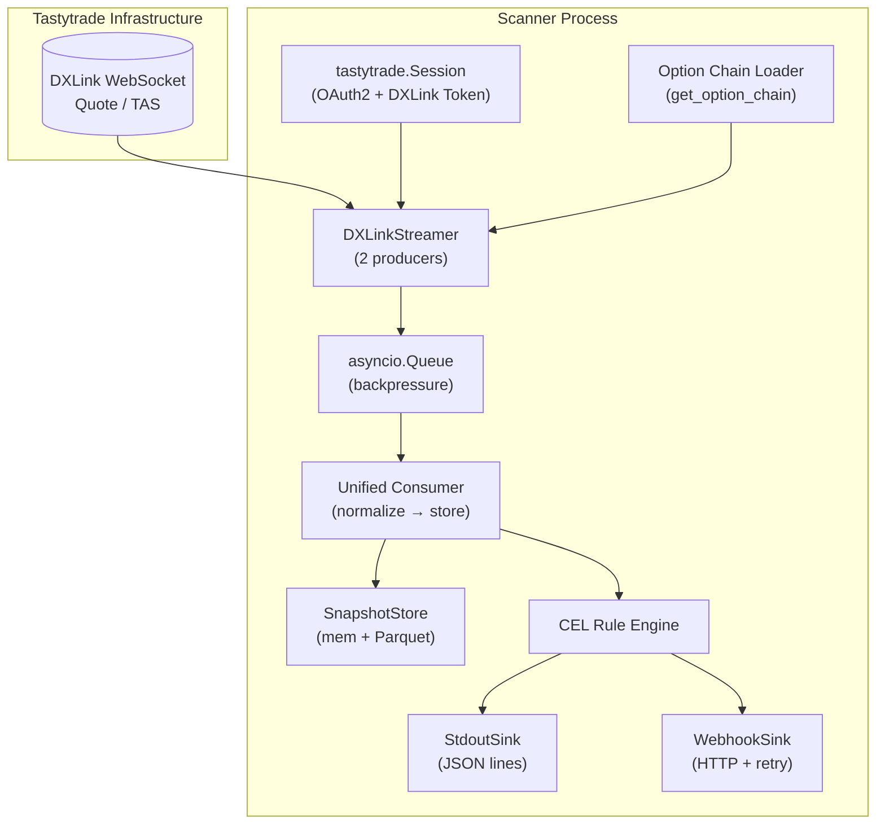
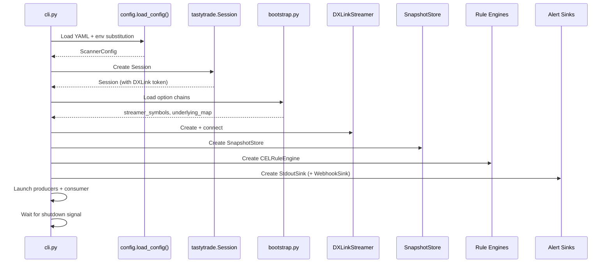

# System Architecture

This document describes the technical process flows, component interactions, and data flow through the Options Radar Zero Scanner.

## High-Level Data Flow



## Component Architecture

### 1. Authentication Layer (`src/dxlink_scanner/auth.py`)

**Purpose**: Obtain and maintain valid Tastytrade session + DXLink token.

```python
# Current: Uses tastytrade.Session (SDK)
from tastytrade.session import Session

session = Session(
    provider_secret=client_secret,
    refresh_token=refresh_token,
    is_test=sandbox,
)
# Session handles:
# - OAuth2 token refresh (auto on session_expiration)
# - DXLink token fetch via POST /api-quote-token
# - Base URL selection (sandbox vs production)
```

**Flow**:
1. Load credentials from config (env var substitution)
2. Create `Session` → auto-fetches DXLink token
3. Pass session to `DXLinkStreamer` and chain loader
4. Session auto-refreshes on expiry (no manual intervention)

### 2. Option Chain Loading (`src/dxlink_scanner/bootstrap.py`)

**Purpose**: Fetch 0DTE option chain for each configured underlying, extract streamer symbols.

```python
# Current: Uses SDK instrument functions
from tastytrade.instruments import get_option_chain, get_future_option_chain

# Equity (SPY, QQQ)
chains = get_option_chain(session, "SPY")  # dict[date, list[Option]]

# Futures (ES, NQ)
chains = get_future_option_chain(session, "ES")  # dict[date, list[FutureOption]]

# Filter to 0DTE (today's expiry)
today = datetime.now(UTC).date()
option_symbols = [opt.streamer_symbol for opt in chains.get(today, [])]
```

**Outputs**:
- `symbol → streamer_symbol` mapping for DXLink subscription
- `symbol → underlying_symbol` mapping for consolidation
- Strike/expiry metadata for dynamic strike management

### 3. DXLink Streaming (`tastytrade.streamer.DXLinkStreamer`)

**Purpose**: Subscribe to real-time market data via WebSocket.

**Two Producers** (run concurrently):
```python
# In cli.py:_run_scanner()
async def _produce_quotes():
    async for quote in streamer.listen_quotes(symbols):
        await queue.put(("QUOTE", quote))

async def _produce_time_and_sales():
    async for tas in streamer.listen_time_and_sales(symbols):
        await queue.put(("TIME_AND_SALE", tas))
```

**Subscription Strategy**:
| Event Type | Symbols | Notes |
|------------|---------|-------|
| Quote | All option symbols + underlying futures | Best bid/ask; mid_price = (bid+ask)/2 |
| TimeAndSale | All option symbols | Trade prints | last_trade_price, last_trade_size, trade_type |

### 4. Backpressure Queue (`asyncio.Queue`)

**Purpose**: Buffer between producers and consumer with explicit backpressure.

```python
# Configurable
queue = asyncio.Queue(maxsize=config.stream.backpressure_queue_size)  # default 500

# Producer side (with timeout)
try:
    await asyncio.wait_for(queue.put((msg_type, msg)), timeout=0.1)
except asyncio.TimeoutError:
    backpressure_dropped_total.labels(type=msg_type).inc()
    logger.warning("Queue full, dropping %s", msg_type)
```

**Drop Policy**: FIFO (oldest dropped) — older events have less analytical value.

### 5. Unified Consumer (`src/dxlink_scanner/cli.py:_consume_consolidated`)

**Purpose**: Single consumer loop normalizing all event types → `ConsolidatedEvent` → `SnapshotStore`.

```python
async def _consume_consolidated(queue, store, rules, sinks):
    while True:
        event = await queue.get()

        # Merge into snapshot
        store.ingest(event)

        # Evaluate rules (if TimeAndSale)
        if event.source_type == "TIME_AND_SALE":
            tas_event = to_time_and_sale_event(event)
            alert = rules.process(tas_event)
            if alert:
                for sink in sinks:
                    await sink.send(alert)

        queue.task_done()
```

**Normalization** (`src/dxlink_scanner/models.py`):
|| DXLink Type | Normalizer | Key Fields Extracted |
||-------------|------------|---------------------|
|| Quote | `normalize_quote()` | bid/ask price |
|| TimeAndSale | `normalize_timeandsale()` | last_trade_price, last_trade_size, last_trade_type |

### 6. Snapshot Store (`src/dxlink_scanner/snapshot_store.py`)

**Purpose**: In-memory per-symbol state + periodic Parquet persistence.

```python
class SnapshotStore:
    def __init__(self, config, underlying_map):
        self._snapshots: dict[str, ConsolidatedSnapshot] = {}
        self._buffer: list[ConsolidatedEvent] = []
        self._flush_task = asyncio.create_task(self._flush_loop())
    
    def ingest(self, event: ConsolidatedEvent):
        snap = self._snapshots.get(event.symbol)
        if snap is None:
            snap = ConsolidatedSnapshot(
                symbol=event.symbol,
                underlying_symbol=self._underlying_map.get(event.symbol, event.symbol),
                updated_at=datetime.now(UTC),
            )
        merge_into_snapshot(snap, event)
        self._snapshots[event.symbol] = snap
        
        # Buffer for Parquet
        self._buffer.append(event)
        if len(self._buffer) >= self._flush_batch_size:
            await self.flush()
    
    async def _flush_loop(self):
        while True:
            await asyncio.sleep(self._flush_interval_sec)
            await self.flush()
    
    async def flush(self):
        if not self._buffer: return
        events = self._buffer
        self._buffer = []
        await self._write_parquet(events)
```

**Parquet Output**:
- Partitioned by date: `data/events/YYYY-MM-DD/events_v1_<uuid>.parquet`
- Schema: `schemas/v1.py` (PyArrow)
- Flush triggers: `flush_batch_size` (10K) OR `flush_interval_sec` (5s)

### 7. Rule Engine (CEL)

The `CELRuleEngine` evaluates config-driven rules using the Common Expression Language. See [docs/cel_rules.md](cel_rules.md) for the full reference.

#### CEL Engine (`src/dxlink_scanner/rules/cel_engine.py:CELRuleEngine`)

**Config-Driven Rules** (per-symbol in YAML):
```yaml
watchlist:
  tickers:
    - symbol: "SPY"
      alert_rules:
        - name: "large_print"
          expression: "trade.size >= 100 && trade.price > 1.0"
          severity: "high"
        - name: "call_sweep"
          expression: "trade.size >= 50 && option.type == 'call'"
          severity: "medium"
```

**Activation Context** (variables available in CEL expressions):
```python
activation = {
    "trade": {symbol, price, size, timestamp, bid_price, ask_price, trade_type},
    "option": {type, strike},  # if option
    "underlying": {symbol, price},  # if underlying
    "stats": {median, mad, count, mean},  # rolling stats for symbol
    "config": {abs_min_size, size_mult},
}
```

### 8. Alert Sinks

#### Stdout Sink (`src/dxlink_scanner/sinks/stdout_sink.py`)
- JSON Lines output (one alert per line)
- `orjson` for fast serialization
- Decimal → string, epoch ms timestamps

#### Webhook Sink (`src/dxlink_scanner/sinks/webhook_sink.py`)
- Async HTTP POST with exponential backoff retry
- Configurable timeout, max_retries
- Reuses `_alert_to_dict()` for payload format

**Output Format**:
```json
{
  "symbol": "SPY250731C00450000:EQ",
  "price": "2.50",
  "size": 150,
  "timestamp_ms": 1722355200000,
  "rule": "size_mult",
  "severity": "high",
  "underlying_price": 450.00
}
```

## Process Lifecycle

### Startup Sequence



### Shutdown Sequence (Graceful)

```python
# In cli.py:_run_scanner()
shutdown_event = asyncio.Event()

def _signal_handler():
    shutdown_event.set()

signal.signal(signal.SIGTERM, _signal_handler)
signal.signal(signal.SIGINT, _signal_handler)

await shutdown_event.wait()  # Block until SIGTERM/SIGINT

# Graceful shutdown
logger.info("Shutdown signal received, flushing...")
await store.flush()           # Write remaining Parquet
await store.close()           # Cleanup
for task in producer_tasks:
    task.cancel()
await asyncio.gather(*producer_tasks, return_exceptions=True)
await consumer_task
logger.info("Shutdown complete")
```

**Trigger**: 17:00 ET (market close) via external scheduler (cron/systemd) sending SIGTERM.

## Concurrency Model

| Component | Concurrency | Notes |
|-----------|-------------|-------|
| DXLink producers | 2 async tasks | One per event type |
| Queue | `asyncio.Queue` | Thread-safe, single consumer |
| Consumer | 1 async task | Sequential processing |
| SnapshotStore | Single-threaded | All access via consumer task |
| Rule engines | Sync calls | Fast, no I/O |
| Sinks | Async | Non-blocking HTTP for webhook |

**Why single consumer?** Avoids race conditions on `SnapshotStore` dict, ensures event ordering per symbol, simplifies backpressure.

## Data Models

### TimeAndSaleEvent (input to rules)
```python
@dataclass(frozen=True, slots=True)
class TimeAndSaleEvent:
    symbol: str
    price: Decimal
    size: int
    timestamp: datetime
    event_type: Literal["TimeAndSale"] = "TimeAndSale"
    bid_price: Decimal | None = None
    ask_price: Decimal | None = None
    trade_type: str | None = None
```

### Alert (output from rules)
```python
@dataclass(frozen=True, slots=True)
class Alert:
    symbol: str
    price: Decimal
    size: int
    timestamp_ms: int          # Epoch milliseconds
    rule_name: str
    severity: str = "high"     # info, low, medium, high, critical
    underlying_price: float | None = None  # from Quote mid_price on underlying
```

### ConsolidatedSnapshot (in-memory state)
```python
@dataclass(slots=True)
class ConsolidatedSnapshot:
    symbol: str
    underlying_symbol: str
    updated_at: datetime
    bid_price: Decimal | None = None
    ask_price: Decimal | None = None
    last_trade_price: Decimal | None = None
    last_trade_size: int | None = None
    last_trade_time: int | None = None      # epoch ms
    last_trade_type: str | None = None
    mid_price: Decimal | None = None
    spread: Decimal | None = None
    spread_bps: float | None = None
    trade_vs_mid: Decimal | None = None
    evict_at: int | None = None             # epoch ms for TTL
```

## Error Handling

| Layer | Strategy |
|-------|----------|
| DXLink producers | Log error, continue (streamer handles reconnect) |
| Queue full | Drop oldest, increment `backpressure_dropped_total` |
| Normalization | Skip event, log warning, continue |
| Rule engine | Catch exceptions per-rule, log, continue to next rule |
| Sinks (stdout) | Log error, continue (non-blocking) |
| Sinks (webhook) | Retry with exponential backoff (configurable) |
| Parquet write | Log error, keep events in buffer, retry next flush |

## Performance Characteristics

| Metric | Target | Notes |
|--------|--------|-------|
| Event latency (receive → snapshot) | < 5ms p99 | Single-threaded consumer |
| Alert latency (trade → output) | < 10ms p99 | Sync rule eval + async sink |
| Memory (10K symbols) | ~20 MB | `@dataclass(slots=True)` |
| Parquet flush (10K events) | < 50ms | Polars + PyArrow |
| CEL rule eval | ~1-5 μs/rule | Compiled AST cached |

## Monitoring & Observability

### Logs
- Structured JSON logging (configurable level)
- Key events: connection, subscription, alerts, flush, drops

### Metrics (Prometheus-style counters)
- `backpressure_dropped_total{type="QUOTE|TAS"}`
- `alerts_total{rule="<cel_rule_name>", severity="..."}`
- `parquet_flush_duration_seconds`
- `parquet_events_written_total`

### Health Checks
- DXLink connection status
- Queue depth (backpressure indicator)
- Parquet flush lag
- Alert rate (alerts/minute)