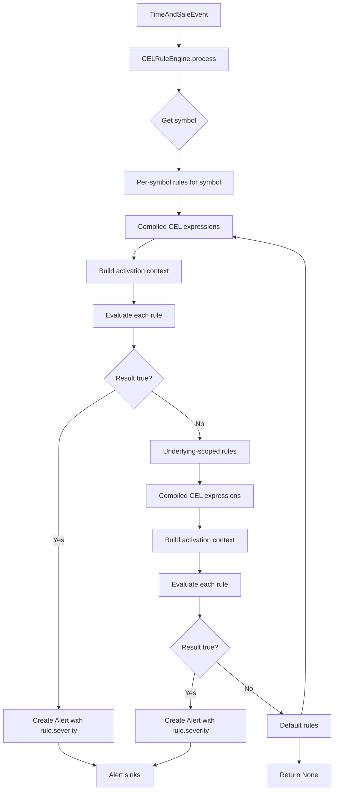

# CEL Rule Engine Reference

Complete reference for the Common Expression Language (CEL) based rule engine for per-symbol alert evaluation.

## Overview

The CEL Rule Engine (`CELRuleEngine`) is the rule evaluation system for per-symbol and underlying-scoped alert evaluation. Rules are defined as CEL expressions in YAML configuration, enabling per-symbol customization without code changes.

## Why CEL?

| Criterion | Assessment |
|-----------|------------|
| **Safety** | ✅ Non-Turing-complete: no loops, recursion, I/O, or side effects |
| **Performance** | ✅ ~1-5 μs/eval (compiled AST, Rust backend via `cel-expr-python`) |
| **Expressiveness** | ✅ Rich stdlib: math, strings, lists, maps, timestamps, regex |
| **Config-Driven** | ✅ Rules as YAML strings — no code deploy for rule changes |
| **Auditability** | ✅ Plain text rules — version controlled, reviewable, testable |
| **Type Safety** | ✅ Static type checking at compile time |

## Quick Start

### Enable CEL Rules

Add `alert_rules` to any ticker in your config:

```yaml
watchlist:
  tickers:
    - symbol: "SPY"
      option_type: "equity"
      strikes_around_atm: 10
      alert_rules:
        - name: "large_option_print"
          expression: "trade.size >= 100 && trade.price > 1.0"
          severity: "high"
        - name: "call_sweep"
          expression: "trade.size >= 50 && option.type == 'call'"
          severity: "medium"
```

### Default Rules (Fallback)

Rules that apply to all symbols without explicit per-symbol or underlying-scoped rules. Defined as `default_alert_rules` under the `watchlist` section.

```yaml
watchlist:
  tickers:
    - symbol: "SPY"
      # ... per-ticker config
  default_alert_rules:
    - name: "absolute_size"
      expression: "trade.size >= 1000"
      severity: "critical"
    - name: "anomaly_detector"
      expression: "trade.size > stats.median * 5.0"
      severity: "high"
```

## CEL Syntax Reference

### Basic Expressions

```cel
# Simple threshold
trade.size >= 100

# Compound conditions
trade.size >= 50 && trade.price > 2.0

# Price range
trade.price >= 0.5 && trade.price <= 5.0

# Time-based (RTH only)
trade.timestamp.hour >= 9 && trade.timestamp.hour <= 16
```

### Operators

| Category | Operators | Notes |
|----------|-----------|-------|
| Arithmetic | `+`, `-`, `*`, `/`, `%` | Standard precedence |
| Comparison | `==`, `!=`, `<`, `<=`, `>`, `>=` | Type-safe |
| Logical | `&&`, `\|\|`, `!` | Short-circuit |
| Membership | `in` | `x in list`, `key in map` |
| Ternary | `cond ? a : b` | `true_val : false_val` |

### Access Patterns

```cel
# Object fields
trade.size
trade.price
option.type

# Map access
config["abs_min_size"]
stats["median"]

# Optional chaining (safe navigation)
option?.type
```

## Activation Context (Variables Available in Rules)

Every rule evaluation receives an **activation** — a binding of variables:

```python
activation = {
    # Core trade fields (always present)
    "trade": {
        "symbol": "SPY250731C00450000:EQ",
        "price": 2.50,           # float (Decimal converted)
        "size": 150,             # int
        "timestamp": "2025-07-31T14:30:00+00:00",  # ISO string
        "bid_price": 2.45,       # float or null
        "ask_price": 2.55,       # float or null
        "trade_type": "buy",     # string or null
    },
    
    # Option metadata (present for option symbols)
    "option": {
        "type": "call",          # "call" | "put"
        "strike": 450.0,         # float
    },
    
    # Underlying info (present for underlying symbols)
    "underlying": {
        "symbol": "SPY",
        "price": 451.25,
    },
    
    # Rolling statistics (pre-computed per symbol)
    "stats": {
        "median": 25.0,          # float
        "mad": 12.0,             # float
        "count": 47,             # int
        "mean": 28.5,            # float
    },
    
    # Config thresholds
    "config": {
        "abs_min_size": 10,
        "size_mult": 5.0,
    },
}
```

### Variable Details

| Variable | Type | Availability | Notes |
|----------|------|--------------|-------|
| `trade` | `map<string, dyn>` | Always | Core trade data |
| `trade.symbol` | `string` | Always | Streamer symbol |
| `trade.price` | `double` | Always | Decimal → float |
| `trade.size` | `int` | Always | Contract count |
| `trade.timestamp` | `string` | Always | ISO 8601 UTC |
| `trade.bid_price` | `double?` | Quote present | Null if no quote |
| `trade.ask_price` | `double?` | Quote present | Null if no quote |
| `trade.trade_type` | `string?` | Always | "buy"/"sell"/null |
| `option` | `map<string, dyn>?` | Option symbols only | Null for underlyings |
| `option.type` | `string` | Option | "call" or "put" |
| `option.strike` | `double` | Option | Strike price |
| `underlying` | `map<string, dyn>?` | Underlying symbols only | Null for options |
| `underlying.symbol` | `string` | Underlying | e.g., "SPY" |
| `underlying.price` | `double` | Underlying | Current price |
| `stats` | `map<string, dyn>` | Always | Rolling stats |
| `stats.median` | `double` | Always | 0.0 if no data |
| `stats.mad` | `double` | Always | 0.0 if no data |
| `stats.count` | `int` | Always | 0 if no data |
| `stats.mean` | `double` | Always | 0.0 if no data |
| `stats.std` | `double` | Always | 0.0 if no data (V2) |
| `stats.p25` | `double` | Always | 0.0 if no data (V2) |
| `stats.p75` | `double` | Always | 0.0 if no data (V2) |
| `stats.p90` | `double` | Always | 0.0 if no data (V2) |
| `stats.p95` | `double` | Always | 0.0 if no data (V2) |
| `stats.p99` | `double` | Always | 0.0 if no data (V2) |
| `stats.z_score` | `double` | Always | 0.0 if no data (V2) |
| `stats.modified_z_score` | `double` | Always | 0.0 if no data (V2) |
| `stats.rth_median` | `double` | Session-aware | RTH median (V2) |
| `stats.rth_mean` | `double` | Session-aware | RTH mean (V2) |
| `stats.rth_std` | `double` | Session-aware | RTH std (V2) |
| `stats.eth_median` | `double` | Session-aware | ETH median (V2) |
| `stats.eth_mean` | `double` | Session-aware | ETH mean (V2) |
| `stats.eth_std` | `double` | Session-aware | ETH std (V2) |
| `config.abs_min_size` | `int` | Always | From detection config |
| `config.size_mult` | `double` | Always | From detection config |

## Rule Configuration

### `CelAlertRule` Schema

```yaml
alert_rules:
  - name: "rule_name"           # Required: unique identifier
    expression: "cel expression" # Required: CEL expression string
    severity: "high"             # Optional: info|low|medium|high|critical (default: high)
```

| Field | Required | Type | Description |
|-------|----------|------|-------------|
| `name` | ✅ | string | Human-readable rule name (used in `Alert.rule_name`) |
| `expression` | ✅ | string | CEL expression that evaluates to boolean |
| `severity` | ❌ | string | Alert severity: `info`, `low`, `medium`, `high`, `critical` |

### Per-Symbol Rules

```yaml
watchlist:
  tickers:
    - symbol: "SPY"
      alert_rules:
        - name: "spy_large_print"
          expression: "trade.size >= 100 && trade.price > 1.0"
          severity: "high"
        - name: "spy_call_sweep"
          expression: "trade.size >= 50 && option.type == 'call'"
          severity: "medium"
```

### Default Rules (Fallback)

Rules that apply to all symbols without explicit per-symbol or underlying-scoped rules. Defined as `default_alert_rules` under the `watchlist` section.

**Evaluation Order**: Per-symbol rules first, then underlying-scoped rules, then default rules. First match wins.

### Underlying-Scoped Rules (Applies to All Options of One Underlying)

Use `underlying_alert_rules` to define rules that automatically apply to **every option symbol** of an underlying — without enumerating each option streamer symbol individually:

```yaml
watchlist:
  tickers:
    - symbol: "SPY"
      option_type: "equity"
      strikes_around_atm: 10
      underlying_alert_rules:
        - name: "spy_any_option_sweep"
          expression: "trade.is_option && trade.size >= 50 && trade.price > 1.0"
          severity: "high"
        - name: "spy_large_print"
          expression: "trade.is_option && trade.size >= 100"
          severity: "medium"
```

**How it works**:
1. The scanner builds an `underlying_symbol_map` during chain loading (option streamer symbol → underlying symbol, e.g. `.SPY260731C500` → `SPY`).
2. When a `TimeAndSale` event arrives for an option symbol, the `CELRuleEngine` resolves the symbol's underlying via this map.
3. The `underlying_alert_rules` from the matching `TickerConfig` are evaluated against the event.
4. If no underlying-scoped rule matches, the engine falls through to `default_alert_rules`.

**Use `trade.is_option`** to restrict a rule to option symbols only (excludes the underlying itself). For underlying-only trades, use `trade.is_option == false`.

**Resolution chain** (first match wins):
1. `alert_rules` — exact match on the streamer symbol
2. `underlying_alert_rules` — resolved from the underlying of an option symbol
3. `default_alert_rules` — global fallback

## Example Rules

### Volume Thresholds

```cel
# Large print on any symbol
trade.size >= 500

# Large option print (price filter)
trade.size >= 100 && trade.price > 2.0

# Small but expensive
trade.size >= 20 && trade.price > 10.0
```

### Option-Specific Rules

```cel
# Call sweep
trade.size >= 50 && option.type == "call"

# Put wall
trade.size >= 100 && option.type == "put"
```

### Anomaly Detection

```cel
# Standard anomaly (5x median)
trade.size > stats.median * 5.0

# Conservative anomaly (3x median, min 20 size)
trade.size >= 20 && trade.size > stats.median * 3.0

# MAD-based (robust to outliers)
trade.size > stats.median + 3.0 * stats.mad

# Volume surge (current > 2x mean)
trade.size > stats.mean * 2.0
```

### Time-Gated Rules

```cel
# RTH only (9:30-16:00 ET, assuming UTC timestamps)
trade.timestamp.hour >= 13 && trade.timestamp.hour <= 20

# Avoid first/last 15 minutes
trade.timestamp.hour > 13 && trade.timestamp.hour < 19

# Power hour (15:00-16:00 ET = 19:00-20:00 UTC)
trade.timestamp.hour == 19
```

### Config-Driven Rules

```cel
# Use detection threshold
trade.size >= config.abs_min_size && trade.size > stats.median * config.size_mult

# Custom size threshold
trade.size >= 200 && trade.price > 1.0
```

### Composite Rules

```cel
# Large call print
trade.size >= 100 && option.type == "call"

# Sweep at bid (aggressive buying)
trade.size >= 50 && trade.trade_type == "buy" && \
trade.price >= trade.ask_price - 0.02
```

## Severity Levels

| Severity | Use Case | Example |
|----------|----------|---------|
| `critical` | Emergency / immediate action | `trade.size >= 5000` |
| `high` | Significant anomaly | `trade.size >= 100 && option.type == 'call'` |
| `medium` | Notable pattern | `trade.size >= 50 && trade.size > stats.median * 5` |
| `low` | Informational | `trade.size >= 20 && is_rth(trade.timestamp)` |
| `info` | Debug / tracking | `trade.size >= 10` |

## Rule Evaluation Flow



## Performance

| Metric | Value |
|--------|-------|
| Compile time (per rule) | ~0.5-2 ms |
| Evaluation time | ~1-5 μs |
| Memory per rule | ~2-5 KB (compiled AST) |
| Max rules per symbol | 50 (practical) |

**Optimization**: All expressions compiled once at startup and cached.

## Testing Rules

### Unit Test Pattern

```python
import pytest
from dxlink_scanner.config import DetectionConfig, WatchlistConfig, TickerConfig, CelAlertRule
from dxlink_scanner.rules.cel_engine import CELRuleEngine
from dxlink_scanner.stats import RollingStatsManager
from datetime import.datetime, UTC
from decimal import Decimal

def make_event(symbol: str, price: str, size: int) -> TimeAndSaleEvent:
    return TimeAndSaleEvent(
        symbol=symbol,
        price=Decimal(price),
        size=size,
        timestamp=datetime.now(UTC),
    )

def test_cel_rule_basic():
    cfg = DetectionConfig()
    watchlist = WatchlistConfig(tickers=[TickerConfig(symbol="SPY")])
    stats = RollingStatsManager(cfg)
    
    rules = {"SPY": [CelAlertRule(
        name="large_print",
        expression="trade.size >= 100",
        severity="high"
    )]}
    
    engine = CELRuleEngine(cfg, watchlist, stats, per_symbol_rules=rules)
    
    # Should trigger
    alert = engine.process(make_event("SPY", "2.50", 150))
    assert alert is not None
    assert alert.rule_name == "large_print"
    assert alert.severity == "high"
    
    # Should not trigger
    alert = engine.process(make_event("SPY", "2.50", 50))
    assert alert is None

def test_cel_rule_with_stats():
    # Warm up stats
    for size in [10, 15, 20, 25, 30]:
        stats.add("SPY", size)
    
    rules = {"SPY": [CelAlertRule(
        name="anomaly",
        expression="trade.size > stats.median * 3.0",
        severity="medium"
    )]}

    engine = CELRuleEngine(cfg, watchlist, stats, per_symbol_rules=rules)
    
    # median=20, 3x = 60, size=70 should trigger
    alert = engine.process(make_event("SPY", "1.00", 70))
    assert alert is not None
    assert alert.rule_name == "anomaly"
```

## Debugging Rules

### Enable Debug Logging

```yaml
logging:
  level: "DEBUG"
```

### Log Output

```
INFO  CEL rule 'large_print' triggered for SPY: size=150, price=2.50
WARNING CEL evaluation error in rule 'call_sweep' for QQQ: no such key: option
```

### Common Errors

| Error | Cause | Fix |
|-------|-------|-----|
| `no such key: option` | Rule references `option.*` for an underlying symbol | Guard with `trade.is_option && ...` |
| `type mismatch` | Comparing string to number | Ensure types match (CEL is strongly typed) |
| `undefined variable` | Typo in variable name | Check activation context reference |

## Best Practices

1. **Keep expressions simple** — complex logic is harder to debug
2. **Use optional chaining** — `option?.type` avoids errors when option data not available
3. **Test with real data** — use `--debug-messages` to capture events for replay
4. **Version control rules** — rules in YAML are code; review like code
5. **Monitor evaluation latency** — add metrics if rules become complex
6. **Use defaults for common patterns** — `default_alert_rules` for shared logic

## Limitations & Gotchas

| Limitation | Workaround |
|------------|------------|
| No loops/recursion | Compose multiple rules or use custom functions |
| No arbitrary math (sin, log) | Add custom functions to CEL environment |
| `trade.timestamp` is string | Parse with `timestamp()` function if needed |
| No persistent state between evaluations | Use `stats` or external store |
| First compile ~1-5ms | Acceptable at startup; cache compiled ASTs |

## Advanced: Custom Functions

Register custom functions in `CELRuleEngine._cel_env()`:

```python
# In cel_engine.py — example of registering a custom function
cel.Function(
    "is_rth",
    cel.Overload(
        "is_rth_ts",
        [cel.Type.TIMESTAMP],
        cel.Type.BOOL,
        lambda ts: 9 <= ts.hour <= 16,
    ),
)
```

**Available custom functions**:
- `is_rth(timestamp)` — returns true if timestamp is during RTH (9:30-16:00 ET)
- `is_option(symbol)` — returns true if the symbol is an option streamer symbol

**Usage**:
```cel
# Alert only during RTH
trade.size >= 100 && is_rth(trade.timestamp)
```

---

*End of Reference*
